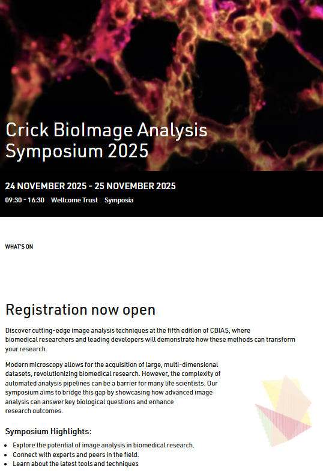
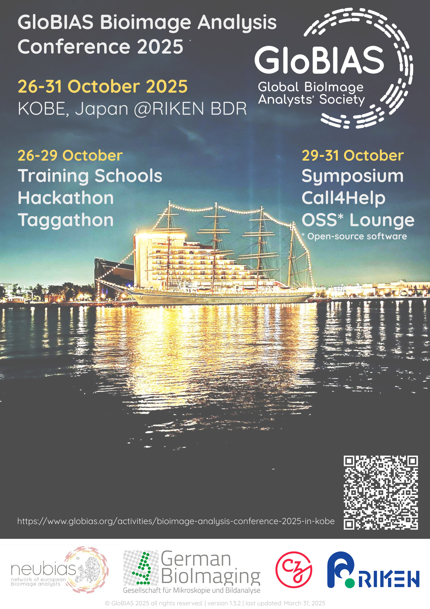
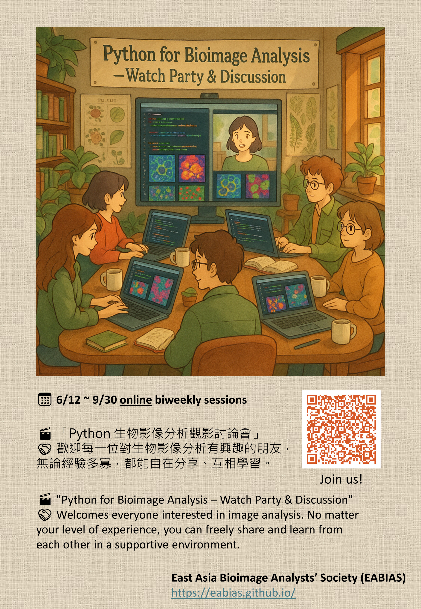
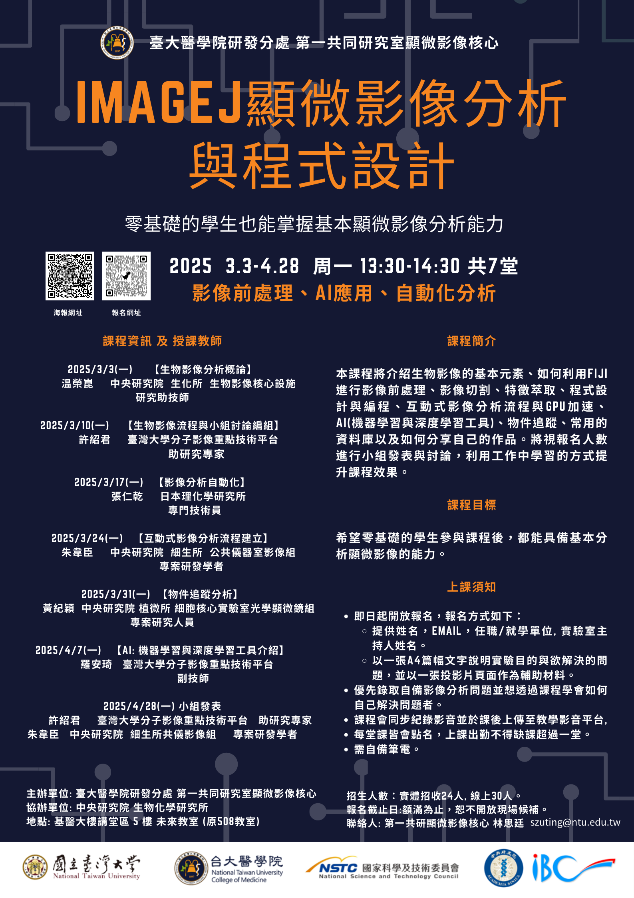

## Upcoming Events

-   ____

    ---

    #### [Halfway to I2K 2025: Free Online Tutorials on Image Analysis](https://www.i2kconference.org/)

-   ____

    ---

    #### [Crick BioImage Analysis Symposium 2025 London/Online](https://www.crick.ac.uk/whats-on/crick-bioimage-analysis-symposium-2025)

---

## Past Events

-   ____

    ---

    #### [GloBIAS Bioimage Analysis Conference 2025 in Kobe](https://www.globias.org/activities/bioimage-analysis-conference-2025-in-kobe)

-   ____

    ---

    #### [Python for Bioimage Analysis -Watch Party & Discussion](https://docs.google.com/document/d/14mRHf7DGSZsFjaJhhjdbVZDhxe5GPa-8wV1EXQE5PuI/edit?usp=sharing)

-   ____

    ---

    #### [ImageJ Microscopic Image Analysis and Macro Programming 2025 Taipei](https://github.com/EABIAS/2025-ImageJ-Micro-Image-Analysis-and-Programming_Taipei)
    
-   <!-- 為了讓排版一致，您可以在這裡新增一個空的卡片，或者放入另一個過去的活動 -->
    &nbsp; 

