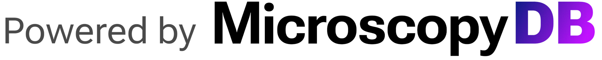

Below is the [Events, Jobs, Tools, Training and Education] database powered by [MicroscopyDB](https://microscopydb.io/)!  
If you have events, tools, training/education resources, or jobs to share, please [add them to the
relevant MicroscopyDB databases](https://microscopydb.io/#add).  
Filter and sort buttons are available at the top of the database [User Guide](https://docs.google.com/document/d/1bsCziK7oXbrlcY-jYet41FkXrjS6lHVrM2Gc81Bp57s/edit?tab=t.0#heading=h.2wa24b1d2zds).

=== "Events"

    <iframe class="airtable-embed" src="https://airtable.com/embed/app20FLvB2SY7JWl3/shrGdd4iz7KWPxmxY?backgroundColor=green&viewControls=on" frameborder="0" onmousewheel="" width="100%" height="533" style="background: transparent; border: 1px solid #ccc;"></iframe>

=== "Jobs"

    <iframe class="airtable-embed" src="https://airtable.com/embed/shr7lEmWiJgDT3R7a?backgroundColor=red&viewControls=on" frameborder="0" onmousewheel="" width="100%" height="533" style="background: transparent; border: 1px solid #ccc;"></iframe>

=== "Training and Education"

    <iframe class="airtable-embed" src="https://airtable.com/embed/appOYzLa3IMl5Vrr7/shrSfqKMABuSK5NPd?backgroundColor=blue&viewControls=on" frameborder="0" onmousewheel="" width="100%" height="533" style="background: transparent; border: 1px solid #ccc;"></iframe>

=== "Tools"

    <iframe class="airtable-embed" src="https://airtable.com/embed/appDBvAnGKHnxnqjL/shrRZGZU92VhtyTdt?backgroundColor=gray&viewControls=on" frameborder="0" onmousewheel="" width="100%" height="533" style="background: transparent; border: 1px solid #ccc;"></iframe>